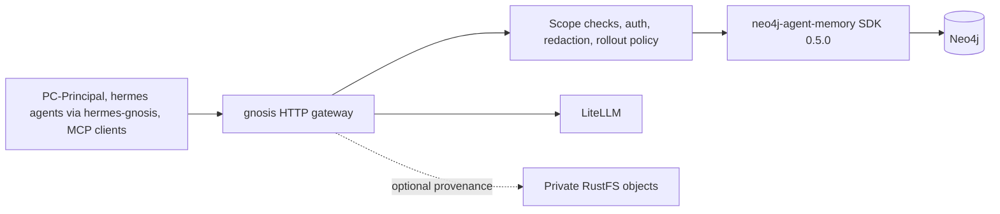
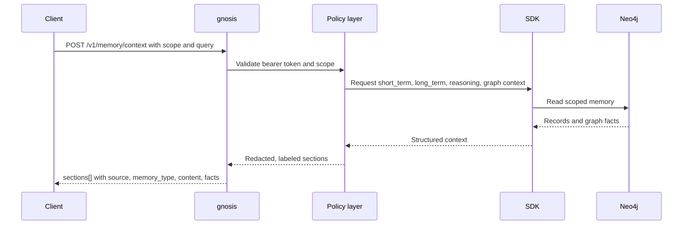

# gnosis

`gnosis` is a self-hosted memory platform for AI agents: a policy gateway in front of a Neo4j knowledge graph that gives every agent scoped, auditable, benchmarked long-term memory over one HTTP API.

- **Multi-client**: serves a Discord bot ([PC-Principal](https://github.com/bromigos-org/PC-Principal)), NousResearch hermes-agent instances (via the [hermes-gnosis](https://github.com/bromigos-org/hermes-gnosis) plugin), and any MCP client — one memory, many agents.
- **Measured, not vibes**: quality is tracked on the LOCOMO and LongMemEval_S agent-memory benchmarks with the official judging protocols — see [Benchmarks](#benchmarks) below.
- **Federated**: sovereign gnosis instances share memory only through explicit, consent-tagged promotion and origin-tagged federated queries.
- **Policy-first**: tenant/scope enforcement, redaction, review-first operator workflows, and safe-by-default feature flags sit in front of every backend access. Clients never touch Neo4j, Bolt, or the SDK directly.

**Documentation** — the [`docs/`](docs/) set: [getting started](docs/getting-started.md) (install, configure, first write & read), [capabilities & algorithms](docs/CAPABILITIES.md) (every technique with its peer-reviewed basis and measured impact), [architecture](docs/architecture.md), [data model](docs/data-model.md), [configuration](docs/configuration.md), [security](docs/security.md), [operations](docs/operations.md), and the [HTTP contract](docs/provider-surface.md).

## Benchmarks

Memory quality is measured through gnosis's real HTTP API on **LOCOMO** (the standard long-horizon agent-memory benchmark; subset 3, 497 questions, judged by GPT-5.5 with the official protocol) and, since 2026-07-04, **LongMemEval_S** (the harder 500-question benchmark, with abstention and knowledge-update axes LOCOMO lacks).

**Preferred config: Run 18** — LLM fact extraction + entity graph at write; adaptive per-query routing + route-aware hardened Chain-of-Note (with the likelihood carve-out) at read. It is the auto-loaded [`configs/default.yaml`](configs/default.yaml) (see [Configuration](#configuration)). Two measurement scopes matter, and both are reported honestly:

- **Subset-3 dev gate** (3 of 10 conversations, 497 questions — the fast regression signal used during development): context J **74.8 excl-adv / 76.7 overall**. Reproducibly ~71 on re-ingest (the 74.8 was a favorable-extraction outlier).
- **Full-LOCOMO (Run 23 — all 10 conversations, the apples-to-apples competitor comparison)**: excl-adv J **66.9–68.9** (gpt-5.5 / gpt-5.4-mini judges) — **competitive with mem0 (66.88)**, ties mem0-graph (68.44), below the full-context ceiling (72.90). Defensible leads: **single-hop, temporal, adversarial**, plus multi-hop on the judge-independent F1.

Subset-3 per-category (the dev gate — not comparable-n to published systems, which report on the full 10):

| Category | baseline (Run 1) | Run 18 (subset-3) | Run 23 (full-10) J |
|---|---|---|---|
| single-hop | 55.0 | 82.0 | **77.0** |
| multi-hop | 10.8 | 44.6 | 41.5 |
| temporal | 24.4 | 91.1 | **73.8** |
| open-domain | 19.1 | 42.9 | 29.2 |
| adversarial (abstention) | 74.1 | 83.0 | **83.9** |
| **overall excl. adversarial** | **37.4** | **74.8** | **66.9** |

### How gnosis compares to other memory systems

LOCOMO J, one system per row, sorted by score. gnosis is shown at **full-LOCOMO (Run 23)** — the apples-to-apples comparison, since published systems report on all 10 conversations. (The subset-3 dev gate reads 74.8, but that compares our easy 3 against everyone's full 10, so it is *not* a competitive claim.)

| System | LOCOMO J | Self-hosted | Graph-backed | Notes |
|---|---|---|---|---|
| Letta | 74.0 | yes | no | filesystem agent, vendor blog run |
| full-context (no memory system) | 72.9 | — | — | entire conversation in the prompt; the ceiling, not a memory system |
| mem0-graph | 68.4 | no¹ | yes | mem0's Neo4j variant; +2 over base mem0 at ~3× latency (their paper) |
| **gnosis — context** | **66.9–68.9** | yes | yes | **full-LOCOMO (Run 23)**, assembled `/v1/memory/context`, Run 18 config; two judges |
| mem0 | 66.9 | no¹ | no | vendor-reported, contested by Zep |
| Zep | 66.0 | no² | yes | vendor-reported, contested by mem0 |
| LangMem | 58.1 | yes | no | library, not a service |
| OpenAI memory | 52.9 | no | no | ChatGPT built-in memory |

Published numbers use a gpt-4o-mini judge and backbone; gnosis rows use GPT-5.5 / gpt-5.4-mini judges — so the comparison is directional, not exact, and cross-vendor numbers in this space are actively disputed (mem0 and Zep contest each other's runs). ¹ mem0 OSS exists but has removed graph-store support; the graph variant effectively requires their platform. ² Zep Community Edition is deprecated; Graphiti (the engine) is self-hostable but is a library, not a multi-tenant service.

Read honestly: on the full 10 conversations gnosis is **competitive with mem0/mem0-graph** — while sending ~4.9k characters, not the entire conversation — with **defensible category leads on single-hop, temporal, and abstention** (adversarial 83.9, which competitors do not publish) and a lead on the judge-independent multi-hop F1. Its genuine weakness is open-domain. gnosis does not top the field, and it does not invent memories it lacks.

### Trajectory (subset-3 dev gate): 37.4 → 74.8

Every measured run, newest last — kept and rejected changes alike (rejections are documented, not hidden). "Context" = assembled `/v1/memory/context`; "search" = raw `/v1/memories/search`; a dash means that condition was not re-run. Runs 1–6 are cumulative; Runs 7–9 are read-path experiments on the Run 5 store; Run 10 is a fresh ingest (extraction + entity graph); Runs 11–19 are read-path experiments on the Run 10 store.

| Run | Change under test | Context J | Search J | Verdict |
|---|---|---|---|---|
| 1 (baseline) | verbatim RAG, gemma4 | 37.4 | 61.3 | starting line |
| 2 (PR #6) | cross-session reads + dates + budget | 41.0 | — | kept (+3.6) |
| 3 (PR #7) | relevance ranking + compact rendering | 59.5 | — | kept (+18.5) |
| 4 (PR #13) | LLM recall filter | 58.7 | 59.0 | **rejected** — flat, +6s/read |
| 5 (PR #14) | **fact extraction at ingest** | **71.2** | 67.3 | **kept** (+11.7, temporal 42→84) |
| 6 (PR #15) | + hybrid BM25 retrieval | 71.4 | 69.1 | wash — temporal +8, multi-hop −5 |
| 7 (PR #19) | abstention prompt (isolated) | 69.6 | 68.1 | adversarial +8.9 but −1.6 excl-adv |
| 8 (PR #20) | facts→verbatim expansion (isolated) | 71.2 | 68.8 | flat headline; multi-hop +2.7 |
| 9 | hybrid + verbatim + supersession STACKED | 57.9 | 29.1 | **crashed −13.3** — features do not compose; proves per-query routing is required |
| 10 (PR #29) | entity graph + graph-QA fusion (fresh ingest) | 70.9 | 67.5 | multi-hop flat — the graph alone is inert without a driver |
| 11 (PR #30+#33) | adaptive per-query routing | 74.3 | 68.8 | **new best** +2.9 — routing composes the per-category winners; adversarial −5.4 |
| 12 (PR #34+#35) | entity-anchored graph traversal alone | 70.7 | 67.3 | **rejected** — multi-hop went down (39.2→36.5) |
| 13 (PR #31) | Chain-of-Note reading instruction alone | 72.0 | — | **kept** — adversarial 79.5, then best ever (+11.6) |
| 14 | routing + Chain-of-Note combined | 71.4 | — | does not stack blindly — CoN parrots hybrid's relative dates on temporal (92.2→83.3) |
| 15 (PR #37) | routing + **route-aware** CoN (skip temporal) | 73.2 | — | **composes** — temporal repaired to 91.1, overall 74.5 = then new best |
| 16 (PR #39) | + directed bridge-entity traversal | 72.5 | — | **rejected as measured** — mechanism works but fires on only 35/497 questions |
| 17 (PR #40) | hardened CoN (attribution + never-guess) | 72.2 | — | adversarial 83.0 best ever; open-domain over-abstains (cost) |
| 18 (PR #41) | + likelihood carve-out in the never-guess rule | **74.8** | — | **NEW BEST on both headlines — the production config** |
| 19 (PR #43+#44) | 2x coverage item budget on multi-hop/aggregative routes | 72.5 | — | **rejected** — gold coverage rose 50%→60%, 0/27 repaired; quantified the ±2.3 J noise floor |

### Benchmark status (2026-07-04)

- **LOCOMO subset 3 is frozen as the regression gate** at the Run 18 config. The benchmark is saturated for this system: Run 19 measured a ±2.3 J excl-adv noise floor between identical configs — wider than every remaining candidate lever — and the largest residual category gap (multi-hop) is capped by exact-list grading, not retrieval. Any future gnosis change re-runs the gate and counts as a regression only if it lands below the noise band, judged per-category.
- **LongMemEval_S is the primary optimization target.** Frozen config: 100-question stratified subset (all 30 abstention instances + 70 sampled proportionally per question type), `gemini-embedding-001` embeddings (3072-dim), gpt-5.5 extraction, the official LongMemEval judge prompts on a frozen gpt-5.5 judge. The baseline run (L-0) is in progress.

Full per-run tables, per-category history, configs, mechanism stats, and honest deviations: [docs/BENCHMARKS.md](docs/BENCHMARKS.md), a mirror of the canonical [gnosis-membench RESULTS.md](https://github.com/bromigos-org/gnosis-membench/blob/main/RESULTS.md). The harness ([gnosis-membench](https://github.com/bromigos-org/gnosis-membench)) re-scores every release weekly in-cluster against a frozen judge, so these numbers cannot silently regress.

## Configuration

Every feature is a flag with a safe default (off). gnosis **auto-loads
[`configs/default.yaml`](configs/default.yaml) — the preferred (best-scoring)
config — out of the box**, so it runs at its best with no setup:

```bash
gnosis                                              # runs configs/default.yaml (Run 18)
GNOSIS_CONFIG_FILE=configs/runs/run11.yaml gnosis   # load a different config
GNOSIS_CONFIG_FILE="" gnosis                         # opt out: safe minimal defaults
```

- **[`configs/default.yaml`](configs/default.yaml)** — the auto-loaded preferred config (Run 18): fact extraction + entity graph at write; adaptive routing + route-aware Chain-of-Note at read. Needs a capable `GNOSIS_LLM` (extraction and routing make LLM calls; the `gemma4` default is not adequate for extraction).
- **[`configs/runs/`](configs/runs/)** — every measured run's config (`runN.yaml`); **[`configs/README.md`](configs/README.md)** ties each run to its file and score.

Precedence, highest first: explicit `GNOSIS_*` env vars → `.env` → the YAML config file → code defaults. So a single env var still overrides one key from the loaded config.

## What it does

- Accepts scoped message and event writes over HTTP.
- Builds prompt-safe memory context across `short_term`, `long_term`, `reasoning`, and graph-backed facts.
- Exposes operator-only search and write APIs for entities, facts, and preferences.
- Supports graph export, stats, dedup review and apply, consolidation dry runs and apply, and buffered write flush.
- Stores reasoning traces for audit and reuse, while keeping hidden chain-of-thought out of prompt recall and public memory.
- Applies redaction, feature flags, and safe defaults before the SDK or database sees a request.

## Architecture



### Code layout

The gateway is a FastAPI app under `src/gnosis/`, organized as focused modules since the 2026-07 refactor (PRs #48–#50) split the former `backend.py` monolith and `main.py` route definitions:

- `backend.py` is the backend facade; the pieces it delegates to live beside it: `backend_protocols.py` (typed protocols for the SDK surface), `sdk_client.py` (the neo4j-agent-memory client surface), `context_assembly.py` (combined memory-context assembly), `ingestion_policy.py` (write-path policy), `reasoning_support.py` (prompt-safe reasoning views), `scope_policy.py` (scope enforcement), `dedup_consolidation.py` (dedup and consolidation flows), and `json_redaction.py` (redaction helpers).
- `main.py` is app wiring plus the context routes (`/v1/context`, `/v1/memory/context`, `/v1/graph/context`) and the MCP mount; all other HTTP route registration lives in the `routes/` package — `system.py` (health, readiness, diagnostics), `memory_provider.py` (the `/v1/memories` provider surface, `/v1/messages`, extraction preview), `operator.py` (stats, export, entity/fact/preference, dedup, consolidation, buffer), `reasoning.py` (traces, steps, tool calls), and `events_skills.py` (events and skills).
- Feature seams have their own modules: `fact_extraction.py` / `extraction_worker.py` / `entity_graph.py` (write path), `query_router.py` / `entity_traversal.py` / `bridge_traversal.py` / `recall_filter.py` / `supersession.py` / `sufficiency.py` (read path), `federation.py`, `mcp_server.py`, and the `graph_*` family (graph QA planning, validation, and upserts).

## Gateway boundary

- `gnosis` is the only Bromigos service in this workspace that talks to Neo4j and the Python SDK directly.
- Callers use HTTP only. They do not open Bolt connections, run Cypher, or import the SDK.
- Scope policy lives here, not in prompt templates or client-side filtering.
- The gateway redacts sensitive backend payloads before returning diagnostics, exports, consolidation reports, or reasoning results.

## Dynamic graph QA

Graph context has two read paths. Known high-value questions can use deterministic Cypher first, such as top active channel aggregates. Other natural-language graph questions can be planned by `GNOSIS_LLM` through the LiteLLM OpenAI-compatible API, then validated before Neo4j sees the query.

The graph QA planner follows the same guidance as Neo4j skill-style Cypher helpers: expose a compact schema guide, require parameterized scope values, return a predictable result shape, and keep write operations out of the prompt contract. The validator is the enforcement boundary, not the prompt.

- Generated Cypher must be read-only and start from `MATCH`, `OPTIONAL MATCH`, `WITH`, or a subquery block.
- Generated Cypher must use `$tenant_id` and must also honor `$guild_id` or `$channel_id` when those scope fields are present.
- Generated Cypher must use `LIMIT $limit` and return rows with `id`, `type`, `summary`, and `deleted`.
- Generated Cypher must use only approved graph labels, relationships, and properties from gnosis' event graph schema.
- Generated Cypher must never use write clauses, unsafe procedures, or raw scope literals.
- PC-Principal and other callers ask natural-language questions over HTTP; only gnosis plans, validates, logs, and executes Cypher.

## Memory model

The primary prompt-facing route is `POST /v1/memory/context`.

- `short_term` covers recent turns and active session continuity.
- `long_term` covers durable facts, preferences, entities, and graph-backed recall.
- `reasoning` covers prior successful traces and tool-use summaries.

Reasoning memory is auditable, not free-form hidden thought. Trace endpoints store lifecycle data, steps, tool calls, and outcomes, but prompt recall must omit chain-of-thought style fields such as `thought` or `chain_of_thought`.

## How the memory systems work together

`gnosis` combines several memory stores into one prompt-safe response, but each store has a different job.

- `short_term` keeps recent conversational continuity for the active session. It answers questions like what was just said, which task is in progress, and what the assistant is already committed to.
- `long_term` keeps durable recall such as stable user preferences, facts worth retaining, named entities, and other knowledge that should survive past one session.
- Graph facts are the structured part of long-term memory. They give callers scoped facts and relationships that can be rendered deterministically or searched by operators.
- Events capture ambient activity that is useful for memory building and audit, even when it is not itself a direct conversation turn.
- `reasoning` stores lifecycle context about traces, steps, tool calls, and outcomes so prior successful work can be reviewed and selectively recalled without exposing hidden chain-of-thought.

The gateway's job is to turn those different stores into one scoped response. A caller sends a `MemoryScope`, the gateway checks auth and scope boundaries, reads the allowed memory types, removes unsafe fields, and returns labeled sections that are safe to render into prompts.

### Combined memory, one request and separate internal layers

`POST /v1/memory/context` is the one-request prompt path, not one merged memory bucket. Callers send a scoped request that conceptually includes:

- `MemoryScope` for tenant, space, agent, session, user, and visibility boundaries.
- The current query or message that needs recall.
- Limits and options that shape how much short-term, long-term, graph-backed, or reasoning context can be considered.

Inside the gateway, those memory classes still stay separate.

- `short_term` is read for recent continuity.
- `long_term` is read for durable recall.
- Graph facts, entities, and preferences are read as structured long-term enrichment.
- `reasoning` is read as prompt-safe lifecycle, tool, and outcome context, not hidden chain-of-thought.

The response is assembled only after scope checks, policy checks, and redaction. Instead of exposing raw backend payloads, the gateway returns prompt-safe `sections[]` entries with labeled fields such as `memory_type`, `source`, `content`, and optional `facts`. That gives clients one scoped response to render while keeping the underlying storage layers separate, auditable, and policy-controlled.

Scope and redaction live here on purpose.

- Scope decides which tenant, space, agent, session, user, guild, channel, and visibility boundary a request is allowed to cross.
- Redaction removes secrets and prompt-unsafe backend payloads before context, diagnostics, exports, or operator reports leave the service.
- Prompt-safe reasoning recall is a filtered view. Audit data may include trace lifecycle detail, but prompt recall must not replay hidden thought fields.

The write paths also serve different purposes.

- Conversation writes through `POST /v1/messages` keep recent turns flowing into short-term memory and any enabled extraction pipeline.
- Event writes through `POST /v1/events` and `POST /v1/events/batch` capture structured activity that can later support recall, extraction, or operator review.
- Operator writes through the entity, fact, and preference endpoints are explicit long-term edits for curated memory updates.
- Reasoning lifecycle writes through the trace, step, tool-call, and complete endpoints record how work was performed and how it ended.

Operator workflows stay review-first.

- Dedup does not silently rewrite memory. Operators inspect candidates first, then apply `merge` or `reject` decisions with scoped dry-run tokens and snapshot checks.
- Consolidation also starts with a dry run. Read operators review the proposed change set, and admin operators apply it only with an explicit follow-up request.
- Direct entity, fact, and preference writes exist for deliberate curation, not as a substitute for broad automatic mutation.

In practice, this means callers can ask for one combined memory response while the gateway keeps the underlying storage classes separate, auditable, and policy-controlled.

## Recall semantics: sharing, sessions, and ranking

These rules decide who sees which memories and in what order. They are enforced by the gateway, not by client convention.

- **Memory is user-centric within a deployment.** Long-term reads are keyed by `tenant_id` + `user_id`. Two agents on the same gnosis asking about the same user see the same memories. `agent_id` and caller metadata (for example the gateway channel) are write-side tags: they are stored on every record for audit and filtered views, but they do not partition recall, and they are redacted out of prompt-facing content. Agents that must not share memory (different business entities) run against their own gnosis deployment with their own tenant and storage.
- **Recall is cross-session.** `session_id` is write provenance only. It is stored on every record and never used as a read filter, so an agent recalls what it learned in earlier sessions. (Context assembly was session-pinned until 2026-07-03; that was a bug, not the contract.)
- **Long-term facts are relevance-ranked and date-anchored.** When a query is present, context assembly ranks facts by embedding similarity over the same candidate pool `/v1/memories/search` uses, then renders each fact as a compact dated line (`- [7 May 2023] ...`), preferring a `session_date`/`date` from stored metadata and falling back to `created_at`. Without a query or embedder it falls back to recency ordering. With `GNOSIS_HYBRID_RETRIEVAL_ENABLED` on, a BM25 full-text search over the same stored facts runs beside the embedding search and the two rankings are fused with Reciprocal Rank Fusion (k=60) before scope re-checks, in both context assembly and `/v1/memories/search`. With `GNOSIS_RECALL_FILTER_ENABLED` on, one `GNOSIS_LLM` call then screens the top `GNOSIS_RECALL_FILTER_CANDIDATES` candidates against the query and keeps only those that could help answer it (EMem-style, arXiv 2511.17208); the filter can only remove candidates, never add them, and any failure or empty selection degrades to the unfiltered ranking. With `GNOSIS_READ_SUPERSESSION_ENABLED` on, a deterministic newest-wins pass then drops same-slot older facts (same normalized subject, plus normalized predicate for typed facts or the first entity for extracted `fact` memories; newest by `event_date` else `created_at`, ties and cross-user/scope facts kept) before the item budget applies in both context assembly and `/v1/memories/search`, never mutating storage (freshness paper arXiv 2606.01435). With `GNOSIS_ABSTENTION_PROMPT_ENABLED` on, context assembly prepends a standing grounding instruction as a leading `instructions` section so clients can abstain when the memories do not contain the answer (AbstentionBench arXiv 2506.09038), and with `GNOSIS_SUFFICIENCY_CHECK_ENABLED` on the context response also carries an additive `sufficiency` block (`{assessed, sufficient, reason?}`) from one `GNOSIS_SUFFICIENCY_MODEL` call judging whether the assembled context answers the query, degrading to `assessed: false` on any failure (Sufficient Context arXiv 2411.06037). With `GNOSIS_FACT_VERBATIM_EXPANSION_ENABLED` on, the top `GNOSIS_FACT_VERBATIM_EXPANSION_MAX` ranked extracted `fact` units additionally render their linked source verbatim turn(s) as an indented `  quote:` line beneath the compact fact — matching on the precise atomic fact but assembling the raw text's nuance alongside — via one scope-narrowed, scope-re-checked batch lookup that never surfaces a cross-scope turn or double-renders a verbatim already in the result set, degrading to the compact fact alone on any lookup failure (EverMemOS facts->episodes; True Memory verbatim). With `GNOSIS_GRAPHQA_FUSION_ENABLED` on and a query present, context assembly additionally runs the existing LLM-planned, validation-gated, scope-safe, read-only graph-QA route in parallel (`asyncio.gather`) with dense long-term retrieval and fuses its derived nodes into the candidate set before supersession and the item budget — a graph *traversal* route (entity→relationship→answer) unioned with the vector route to target multi-hop questions the chain of intermediate facts dense matching displaces (Mnemis dual-route, arXiv 2602.15313); a node already present (same memory id or same rendered line) is not double-added, the route is bounded by `GNOSIS_GRAPHQA_FUSION_TIMEOUT_SECONDS`, and any planner/execution failure, validation rejection, or timeout logs a structured warning and degrades to dense-only so the context request never fails. That traversal route only has entity edges to walk when `GNOSIS_ENTITY_GRAPH_ENABLED` was on at ingest: it materializes a per-user knowledge graph next to each extracted `fact` — `(:Entity)` nodes deduplicated within tenant+user scope, `(:Fact)-[:MENTIONS]->(:Entity)` provenance edges, and directed `(:Entity)-[:RELATES {relation, fact_id, event_date}]->(:Entity)` edges from extracted `(head, relation, tail)` triples — so the graph-QA planner (whose validator scopes every `Entity`/`Fact` alias by both `tenant_id` and `user_id`) can walk `RELATES`/`MENTIONS` to answer the multi-hop bridge questions dense retrieval misses; because it is a write-path change, the gain shows only on a fresh ingest with the flag on.
- **Default ingestion is verbatim; distillation is opt-in.** With `GNOSIS_FACT_EXTRACTION_ENABLED` off (the default), conversation adds store each turn as a dated `said_user`/`said_assistant` fact plus its embedding — no LLM runs at ingest and gnosis behaves as a dated retrieval store. With the flag on, each `messages` + `infer=true` add and each `/v1/messages` write makes one `GNOSIS_FACT_EXTRACTION_MODEL` call (default: `GNOSIS_LLM`) that decomposes the new turns into short, self-contained, entity-normalized memory units (EMem-style enriched event units, arXiv 2511.17208), using the last `GNOSIS_FACT_EXTRACTION_CONTEXT_TURNS` session turns for reference resolution and resolving relative dates against the caller's `metadata.session_date` (or the ingest date). Units are written as ordinary `fact`-predicate memories alongside — never instead of — the verbatim turns, carry `extracted`/`extraction_version`/`extraction_model`/`event_date`/`entities` plus provenance metadata, bypass write-time fact dedup (append-only; contradictions resolve at read time by recency), and are appended to the add response as extra `ADD` results. Extraction is strictly additive: any LLM, schema, or timeout failure logs a structured warning and the add succeeds verbatim-only, exactly as with the flag off. By default (`GNOSIS_FACT_EXTRACTION_MODE=sync`) the extraction call runs in the request path, so adds cost one LLM round-trip (~2–5s on a frontier model); with `GNOSIS_FACT_EXTRACTION_MODE=background` the write returns immediately after the verbatim facts land (the response carries only the verbatim results) and extraction runs on a bounded in-process queue, so extracted facts become recallable a few seconds after the add.
- **Visibility, space, guild, and channel boundaries** still isolate as before; user-centric sharing only applies within a matching scope.

## Federation

Two sovereign gnosis deployments can selectively share memories — for example the `bromigos` deployment (serving the [PC-Principal](https://github.com/bromigos-org/PC-Principal) Discord bot and NousResearch hermes agents via the [hermes-gnosis](https://github.com/bromigos-org/hermes-gnosis) plugin) peered with a second sovereign deployment, `partner`. Each runs its own gnosis instance with a separate tenant, storage, and memory — fully isolated — and the two share only consented memories across the boundary. Federation is off by default in both directions, and one peer concept backs both the push and the pull path.

### Peer model

`GNOSIS_PEERS` is a JSON list of the remote deployments this instance may talk to, validated at startup:

```json
[
  {
    "name": "partner",
    "base_url": "http://gnosis-partner.gnosis-partner.svc.cluster.local:8080",
    "direction": "both",
    "remote_tenant_id": "partner"
  }
]
```

`direction` is `push`, `pull`, or `both` and gates which federation operations may target the peer. Peer names must be unique. Each peer's outbound bearer token comes from `GNOSIS_PEER_<NAME>_TOKEN` (name uppercased, `-` mapped to `_`); its value must be the remote instance's `GNOSIS_FEDERATION_TOKEN`.

### Shareable tagging is consent

Nothing is federated implicitly. A memory can cross a deployment boundary only when its metadata carries `"shareable": true`. The gateway conjoins a mandatory `metadata.shareable == true` filter onto every federated read and every promote candidate scan, regardless of caller filters. Promotion strips `shareable` from the pushed copy, so sharing is never transitive: the receiving tenant decides its own consent tags.

### The federation token class

`GNOSIS_FEDERATION_TOKEN` (default empty, meaning inbound federation is disabled) is a dedicated inbound token class, checked with constant-time comparison like every other token class. Callers presenting it are federated and can reach exactly three routes:

- `POST /v1/memories/search` and `POST /v1/memories/list`: reads, with the shareable-only conjunct injected server-side.
- `POST /v1/memories`: writes, accepted only when `metadata.promoted_from` is present (`403` otherwise).

Every other route answers `403` for this token class. Federated callers also cannot name `peers` in a search (`403`), so federation cannot loop between instances.

### Promote (push, review-first)

`POST /v1/memories/promote` with `{peer, scope, filters?, limit: 50, dry_run: true}` pushes shareable memories to a peer. Like dedup and consolidation, it is review-first: the default `dry_run=true` returns the candidate list (`{peer, count, candidates}`) with no side effects. With `dry_run=false`, each candidate is posted to the peer's `/v1/memories` as a verbatim add (`infer=false`) with redaction applied and provenance metadata `{promoted_from, source_memory_id, promoted_at}` merged in, under the scope `{tenant_id: <peer remote_tenant_id>, space_id: "federation", agent_id: "gnosis:<local tenant>", session_id: "promote", user_id: <same user>, visibility: "private_user"}`. The response is a manifest of `promoted` and `failed` entries; partial failure is tolerated and reported per memory. Pushes run with bounded concurrency and a ~15s per-call timeout. The route requires the normal service token, because callers promote their own scope; operator token classes are not accepted.

### Federated search (pull)

`POST /v1/memories/search` accepts an optional `peers: []` list. For each named pull-capable peer, the gateway fans the same query out to the peer's `/v1/memories/search` with the scope tenant mapped to the peer's `remote_tenant_id` (per-peer timeout ~10s). The remote side authenticates the peer token as a federated caller, so only explicitly shareable memories ever come back. Remote results merge with local ones by score descending, capped at `limit`, and every result gains `origin: "local" | "<peer name>"`. A failed or timed-out peer degrades gracefully into `peer_errors: [{peer, error}]` rather than a 5xx. Without `peers`, the response contract is unchanged.

### Enabling federation between two deployments

On the `bromigos` instance (peering with a second deployment, `partner`):

- `GNOSIS_PEERS='[{"name": "partner", "base_url": "http://gnosis-partner.gnosis-partner.svc.cluster.local:8080", "direction": "both", "remote_tenant_id": "partner"}]'`
- `GNOSIS_PEER_PARTNER_TOKEN=<partner's GNOSIS_FEDERATION_TOKEN>`
- `GNOSIS_FEDERATION_TOKEN=<bromigos inbound federation token>`

On the `partner` instance, mirror it: name the `bromigos` peer with the bromigos base URL and `remote_tenant_id: "bromigos"`, set `GNOSIS_PEER_BROMIGOS_TOKEN` to bromigos' `GNOSIS_FEDERATION_TOKEN`, and set the partner's own `GNOSIS_FEDERATION_TOKEN`. Tokens are expected to come from secret-backed deployment config, like the operator tokens.

## Request and data flow



## API surface

### Health and diagnostics

- `GET /health` for shallow liveness.
- `GET /ready` for readiness after backend connection, schema bootstrap, and buffer readiness.
- `GET /v1/diagnostics` for authenticated non-secret configuration and backend readiness.

### Prompt and recall routes

- `POST /v1/context` keeps the legacy short-term contract. It is deprecated; see [Migrating from /v1/context](#migrating-from-v1context).
- `POST /v1/memory/context` is the main combined memory endpoint.
- `POST /v1/graph/context` returns graph recall and scoped facts.
- `POST /v1/reasoning/context` returns prompt-safe reasoning recall.

### Migrating from /v1/context

`POST /v1/context` is deprecated in favor of `POST /v1/memory/context`. The legacy route now delegates to the same combined memory-context path with only the short-term section enabled, answers with `Deprecation: true` and `Link: </v1/memory/context>; rel="successor-version"` headers, and is marked deprecated in the OpenAPI schema.

Request fields map as follows:

| `/v1/context` field | `/v1/memory/context` field | Notes |
| --- | --- | --- |
| `scope` | `scope` | Unchanged. |
| `query` | `query` | Unchanged. |
| `limit` | `max_items` | Legacy default `8`, max `30`; successor allows up to `100`. |
| n/a | `include_short_term` | Use `true` to match the legacy behavior. |
| n/a | `include_long_term`, `include_reasoning`, `include_graph` | Use `false` to match the legacy behavior; enable as needed. |
| n/a | `graph_limit` | Only relevant when `include_graph` is `true`. |

The legacy response `{"context": "..."}` corresponds to the `content` of the `short_term` section in the successor response `{"sections": [...]}`; an empty legacy `context` corresponds to that section being absent.

Deprecation policy: `/v1/context` stays available until operator logs show no remaining traffic (each process logs a structured warning on first use of the route), after which it will be removed in a future minor release.

### Message and event ingestion

- `POST /v1/messages` writes scoped user, assistant, or system messages.
- `POST /v1/events` writes one structured client event.
- `POST /v1/events/batch` writes up to 100 structured events per request.
- `POST /v1/memory/extraction/preview` previews extraction candidates before durable writes.

### Memory provider routes

The `/v1/memories` surface exposes provider-style CRUD over scoped long-term memories. Every response carries stable memory ids. The full contract lives in `docs/provider-surface.md`.

- `POST /v1/memories` adds memories: `messages` with `infer=true` syncs a conversation pair through the extraction path, `content` with `infer=false` stores a verbatim durable memory.
- `POST /v1/memories/search` runs relevance-ranked semantic search with an optional mem0-v2-style `filters` DSL and `min_score` floor.
- `POST /v1/memories/list` returns deterministic pages ordered by `created_at` descending, with `total`, `page`, and `page_size`.
- `POST /v1/memories/promote` pushes shareable memories to a federation peer, review-first via `dry_run` (see [Federation](#federation)).
- `PATCH /v1/memories/{memory_id}` updates content or metadata for a memory owned by the request scope.
- `DELETE /v1/memories/{memory_id}` deletes a memory owned by the request scope.

Update and delete are gated behind `GNOSIS_MEMORY_EDIT_ENABLED` (default off) and return `403` while disabled. Both verify tenant and `user_id` ownership first and answer `404` for anything outside the caller's scope, so cross-scope existence never leaks. `scope.user_id` is the read filter for search and list; `agent_id` and caller metadata are write-side tags on the stored records.

### MCP server

When `GNOSIS_MCP_ENABLED` is on, gnosis mounts a streamable-HTTP MCP server at `/mcp` behind the same bearer token. It exposes exactly six tools: `add_memory`, `search_memory`, `get_context`, `list_memories`, `delete_memory`, and `get_status`. Tools construct the scope server-side: tenant from settings, `space_id` `mcp`, agent from `GNOSIS_MCP_AGENT_ID`, and `private_user` visibility. The MCP layer stays thin and delegates to the same backend operations as the HTTP routes; `delete_memory` honors `GNOSIS_MEMORY_EDIT_ENABLED`.

### Clients

- **PC-Principal** (Discord bot) uses the full gateway surface: combined memory context, message write-back, event batch ingestion, skills, and reasoning traces.
- **hermes-agent** (e.g. `bromigo`) connects through the [`hermes-gnosis`](https://github.com/bromigos-org/hermes-gnosis) memory-provider plugin, which drives the `/v1/memories` surface.
- **MCP clients** (Claude, Cursor, and similar) connect to `/mcp` when `GNOSIS_MCP_ENABLED` is on.

### Operator routes

- `GET /v1/memory/stats`
- `POST /v1/memory/graph/export`
- `POST /v1/memory/entities/search`
- `POST /v1/memory/facts/search`
- `POST /v1/memory/preferences/search`
- `POST /v1/memory/entities`
- `POST /v1/memory/facts`
- `POST /v1/memory/preferences`
- `GET /v1/memory/dedup/stats`
- `POST /v1/memory/dedup/candidates`
- `POST /v1/memory/dedup/apply`
- `POST /v1/memory/consolidation/dry-run`
- `POST /v1/memory/consolidation/apply`
- `POST /v1/memory/buffer/flush`

### Skill and reasoning routes

- `POST /v1/skills`
- `POST /v1/skills/proposals`
- `POST /v1/skills/usage`
- `POST /v1/reasoning/traces`
- `POST /v1/reasoning/traces/{trace_id}/steps`
- `POST /v1/reasoning/steps/{step_id}/tool-calls`
- `POST /v1/reasoning/traces/{trace_id}/complete`
- `POST /v1/reasoning/traces/list`
- `POST /v1/reasoning/traces/{trace_id}/detail`
- `POST /v1/reasoning/traces/similar`
- `POST /v1/reasoning/steps/search`
- `POST /v1/reasoning/tools/stats`

All routes except `/health` and `/ready` require `Authorization: Bearer <token>`.

## Auth and scope model

Every request is tenant-scoped through `MemoryScope`.

- `tenant_id`, `space_id`, `agent_id`, `session_id`, `user_id`, and `visibility` are required.
- Optional `guild_id` and `channel_id` support Discord-aware scoping.
- The gateway rejects scope mismatches before the backend runs.

Operator boundaries are split by token class.

- `GNOSIS_TOKEN` for normal caller routes.
- `GNOSIS_READ_OPERATOR_TOKEN` for diagnostics, stats, and search-style operator reads.
- `GNOSIS_EXPORT_OPERATOR_TOKEN` for graph export.
- `GNOSIS_WRITE_OPERATOR_TOKEN` for direct entity, fact, and preference writes.
- `GNOSIS_ADMIN_OPERATOR_TOKEN` for dedup apply, consolidation apply, and buffer flush.
- `GNOSIS_FEDERATION_TOKEN` for inbound federated peers: shareable-only memory reads and promoted writes, nothing else (see [Federation](#federation)).

Production should not rely on predictable token defaults. Operator tokens are expected to come from secret-backed deployment config.

## Safe defaults and rollout posture

Several features exist, but they are controlled and not silently enabled.

- Extraction is off by default.
- Relation extraction is off by default and depends on entity extraction.
- OCR is off by default.
- RustFS source references are off by default.
- Prompt enrichment from entities, preferences, and reasoning is off by default.
- The LLM recall filter is off by default (`GNOSIS_RECALL_FILTER_ENABLED`).
- Hybrid lexical+dense retrieval is off by default (`GNOSIS_HYBRID_RETRIEVAL_ENABLED`).
- Scope-narrowed dense retrieval is off by default (`GNOSIS_SCOPED_DENSE_RETRIEVAL_ENABLED`).
- Read-time deterministic supersession is off by default (`GNOSIS_READ_SUPERSESSION_ENABLED`).
- The sufficiency autorater is off by default (`GNOSIS_SUFFICIENCY_CHECK_ENABLED`).
- The abstention grounding prompt is off by default (`GNOSIS_ABSTENTION_PROMPT_ENABLED`).
- The Chain-of-Note reading instruction is off by default (`GNOSIS_CHAIN_OF_NOTE_ENABLED`).
- Facts-to-verbatim expansion is off by default (`GNOSIS_FACT_VERBATIM_EXPANSION_ENABLED`).
- Graph-QA fusion into context assembly is off by default (`GNOSIS_GRAPHQA_FUSION_ENABLED`).
- Adaptive per-query retrieval routing is off by default (`GNOSIS_ADAPTIVE_ROUTING_ENABLED`).
- Ingest-time fact extraction is off by default (`GNOSIS_FACT_EXTRACTION_ENABLED`).
- Entity-relationship graph materialization at extraction time is off by default (`GNOSIS_ENTITY_GRAPH_ENABLED`).
- Entity-anchored graph traversal in context assembly is off by default (`GNOSIS_GRAPH_TRAVERSAL_ENABLED`).
- Directed bridge-entity traversal in context assembly is off by default (`GNOSIS_BRIDGE_TRAVERSAL_ENABLED`).
- The coverage item-budget multiplier is 1 (off) by default (`GNOSIS_COVERAGE_BUDGET_MULTIPLIER`).
- Consolidation scheduling is off by default.
- Buffered writes exist, but the default write mode is `sync`.
- Memory update and delete are off by default (`GNOSIS_MEMORY_EDIT_ENABLED`).
- The MCP server mount is off by default (`GNOSIS_MCP_ENABLED`).
- Federation is off by default in both directions: no peers (`GNOSIS_PEERS`) and no inbound federation token (`GNOSIS_FEDERATION_TOKEN`).

Preview comes before persistence. If extraction work is being evaluated, use `POST /v1/memory/extraction/preview` first.

## Extraction, OCR, and RustFS

- `POST /v1/messages` and `POST /v1/memory/extraction/preview` can carry raw text documents, OCR image references, and RustFS source references.
- OCR calls go through LiteLLM when enabled, with the homelab OCR alias configured as `unlimited-ocr`.
- RustFS is for private source artifacts and provenance, not public attachment dumping.
- Neo4j stores extracted text, provenance, checksums, source URIs, and metadata. It should not store raw media bytes.

## Dedup, consolidation, and buffering

- Dedup is review-first. Operators fetch candidate sets and apply a scoped `merge` or `reject` using dry-run tokens, snapshot hashes, and idempotency keys.
- Consolidation is also review-first. Dry runs are read-operator operations, apply requires admin operator auth and an explicit `apply=true` request.
- Buffered writes are available, but they are not the silent default. Operators can flush pending writes with `POST /v1/memory/buffer/flush`.

## Configuration

### Core settings

- `GNOSIS_TOKEN`
- `GNOSIS_READ_OPERATOR_TOKEN`
- `GNOSIS_EXPORT_OPERATOR_TOKEN`
- `GNOSIS_WRITE_OPERATOR_TOKEN`
- `GNOSIS_ADMIN_OPERATOR_TOKEN`
- `GNOSIS_TENANT_ID`
- `NEO4J_URI`
- `NEO4J_USERNAME`
- `NEO4J_PASSWORD`
- `LITELLM_BASE_URL`
- `LITELLM_API_KEY`
- `GNOSIS_LLM`
- `GNOSIS_EMBEDDING`
- `GNOSIS_EMBEDDING_DIMENSIONS`

### Feature and policy settings

- `GNOSIS_AUDIT_READ`
- `GNOSIS_CONVERSATION_TTL_DAYS`
- `GNOSIS_WRITE_MODE`
- `GNOSIS_MAX_PENDING`
- `GNOSIS_FACT_DEDUPLICATION_ENABLED`
- `GNOSIS_TRACE_EMBEDDING_ENABLED`
- `GNOSIS_EXTRACT_ENTITIES_ENABLED`
- `GNOSIS_EXTRACT_RELATIONS_ENABLED`
- `GNOSIS_EXTRACTION_PREVIEW_ENABLED`
- `GNOSIS_EXTRACTION_BATCH_SIZE`
- `GNOSIS_EXTRACTION_MAX_CONCURRENCY`
- `GNOSIS_EXTRACTION_CHUNK_SIZE`
- `GNOSIS_EXTRACTION_CHUNK_OVERLAP`
- `GNOSIS_OCR_ENABLED`
- `GNOSIS_OCR_MODEL`
- `GNOSIS_OCR_MAX_IMAGE_BYTES`
- `GNOSIS_RUSTFS_ENABLED`
- `GNOSIS_RUSTFS_ENDPOINT`
- `GNOSIS_RUSTFS_BUCKET`
- `GNOSIS_RUSTFS_PREFIX`
- `GNOSIS_RUSTFS_RETENTION_DAYS`
- `GNOSIS_PROMPT_ENTITIES_ENABLED`
- `GNOSIS_PROMPT_PREFERENCES_ENABLED`
- `GNOSIS_PROMPT_REASONING_ENABLED`
- `GNOSIS_RECALL_FILTER_ENABLED` runs one `GNOSIS_LLM` call after retrieval ranking to drop query-irrelevant long-term candidates in `/v1/memory/context` and `/v1/memories/search` (default `false`).
- `GNOSIS_RECALL_FILTER_CANDIDATES` caps how many top-ranked candidates that call screens (default `30`).
- `GNOSIS_HYBRID_RETRIEVAL_ENABLED` runs a BM25 full-text search over stored fact content beside the vector search and fuses the two rankings with Reciprocal Rank Fusion (k=60) in `/v1/memories/search` and `/v1/memory/context`; any full-text failure degrades to dense-only retrieval (default `false`).
- `GNOSIS_SCOPED_DENSE_RETRIEVAL_ENABLED` replaces the SDK's global vector ranking with a scope-narrowed vector query (over-fetch the fact index by `GNOSIS_DENSE_SCOPE_POOL` neighbours, filter to tenant/user in-query) in `/v1/memories/search` and `/v1/memory/context`, so other users' near-duplicate facts cannot crowd the requesting user out of the dense candidate pool in multi-user stores; any failure degrades to the global ranking (default `false`).
- `GNOSIS_DENSE_SCOPE_POOL` caps the scoped dense over-fetch (default `4000`).
- `GNOSIS_READ_SUPERSESSION_ENABLED` deterministically drops same-slot older facts at read time in `/v1/memory/context` and `/v1/memories/search` (newest wins by `event_date` else `created_at`), keeping only the newest per slot without mutating storage - append-only stays (default `false`).
- `GNOSIS_SUFFICIENCY_CHECK_ENABLED` adds an optional `sufficiency` block to the `/v1/memory/context` response via one `GNOSIS_SUFFICIENCY_MODEL` call judging whether the assembled context can answer the query; any failure degrades to `assessed: false` and never blocks the response (default `false`).
- `GNOSIS_SUFFICIENCY_MODEL` is the LiteLLM model for that sufficiency call (default empty, meaning `GNOSIS_LLM`).
- `GNOSIS_ABSTENTION_PROMPT_ENABLED` prepends a standing grounding instruction ("Answer only from the memories below; if they do not contain the answer, say you don't know.") as a leading `instructions` section in `/v1/memory/context` (default `false`).
- `GNOSIS_CHAIN_OF_NOTE_ENABLED` prepends a Chain-of-Note read-then-reason instruction as a leading `instructions` section in `/v1/memory/context`: the answering model is told to first note each memory's relevance, what it says, who it is about, and contradictions, ignore similar-but-irrelevant memories (especially ones about a different person than the question asks about), then answer only from the relevant ones or say it doesn't know - never guessing, never answering yes/no about something the memories never mention, but inferring the most plausible answer when the question itself asks what is likely (arXiv 2311.09210; LongMemEval measures up to +10 QA points from structured reading on conversational memory, and the note step raises rejection of unanswerable questions rather than suppressing it). Prompt-only - no extra LLM call, no schema; when both this and the abstention prompt are on, this instruction renders alone since it subsumes the bare grounding line. Route-aware: with `GNOSIS_ADAPTIVE_ROUTING_ENABLED` also on, the instruction is applied on every route *except* temporal — measured (Run 14, 2026-07-04) because the note step makes the reader faithfully report the relative dates in hybrid retrieval's raw verbatim turns ("last Saturday") instead of the resolved dated facts, costing temporal 8.9 J when stacked globally (default `false`).
- `GNOSIS_CON_SPECULATIVE_INFERENCE_ENABLED` widens the Chain-of-Note inference carve-out (default `false`, byte-identical instruction while off): instead of permitting inference only when the question literally asks what is likely or probable, the instruction also permits it for speculative judgments about a person — what they would enjoy, prefer, or do, what they might be or believe, whether they would be considered something — while still forbidding invented specific facts (names, places, events, dates, numbers). Measured motivation: LOCOMO Run 18 open-domain misses were dominated (8/12) by abstentions on speculative questions phrased without the word "likely" ("Would Caroline pursue writing as a career option?"), which the narrow carve-out never reaches; the specific-facts guard preserves the adversarial behavior the never-guess rule bought.
- `GNOSIS_CON_ENUMERATION_ENABLED` appends an exhaustive-enumeration clause to the Chain-of-Note instruction on multi-hop- and aggregative-routed context reads only (default `false`, byte-identical while off; requires `GNOSIS_ADAPTIVE_ROUTING_ENABLED` to ever fire): when the question asks for a list, enumerate every distinct item the relevant memories support rather than the most prominent one, and when it asks how many, count distinct occurrences and state the number. Measured motivation: LOCOMO Run 19 proved the enumeration misses are a reader problem, not retrieval — doubling the item budget raised gold-item coverage 50%→60% and repaired 0 of 27 enumeration questions, with even fully-covered questions answering with a single salient item.
- `GNOSIS_FACT_VERBATIM_EXPANSION_ENABLED` surfaces provenance in `/v1/memory/context`: after the long-term facts are ranked, superseded, and cut to the item budget, the highest-ranked extracted `fact` units have their linked source verbatim turn(s) fetched by one scope-narrowed, scope-re-checked batch lookup and rendered as an indented `  quote:` line under the compact fact, giving the answer model the atomic fact's precision plus the raw text's nuance (EverMemOS facts->episodes; True Memory verbatim). A verbatim turn already independently in the result set is never double-rendered, any lookup failure or empty source set degrades to the compact fact alone, and it is byte-identical with the flag off (default `false`).
- `GNOSIS_FACT_VERBATIM_EXPANSION_MAX` caps how many top-ranked extracted facts expand their verbatim source turns so the addition never blows the context budget (default `5`).
- `GNOSIS_GRAPHQA_FUSION_ENABLED` runs the existing LLM-planned, validation-gated, scope-safe, read-only graph-QA route in parallel with dense long-term retrieval during `/v1/memory/context` assembly and fuses its derived nodes into the candidate set before supersession and the item budget, targeting multi-hop questions with graph traversal (Mnemis dual-route, arXiv 2602.15313); it is distinct from the per-request `include_graph` flag (which renders a separate graph section rather than fusing into the ranked facts), dedupes nodes already present (same memory id or rendered line), and degrades to dense-only on any planner/execution failure, validation rejection, or timeout without failing the request. The planner needs `GNOSIS_LLM` set to a model capable of generating valid scoped Cypher plans (default `false`).
- `GNOSIS_GRAPHQA_FUSION_TIMEOUT_SECONDS` bounds the parallel graph-QA fusion route so a slow planner cannot stall the context call; on timeout the route degrades to dense-only (default `5.0`).
- `GNOSIS_ADAPTIVE_ROUTING_ENABLED` classifies each `/v1/memory/context` and `/v1/memories/search` query with one cheap structured-output `GNOSIS_ROUTING_MODEL` call (temporal / multi-hop / single-hop / unanswerable-risk / aggregative) and applies that route's measured-best read-path feature set for the request instead of the global toggles: temporal gets hybrid BM25 fusion, multi-hop gets graph-QA fusion plus facts-to-verbatim expansion (and explicitly not hybrid), unanswerable-risk gets the abstention grounding instruction, single-hop and aggregative get plain dense ranking (Adaptive-RAG, arXiv 2403.14403 — benchmarked here because the per-category peaks measurably do not stack when globally combined). Any classifier failure degrades to the globally configured flags with a structured warning, so routing can never fail a read; byte-identical behavior with the flag off (default `false`). Measured (Run 11): +2.9 J excl-adv over the best global config — routing is the composability fix and part of the measured-best Run 18 config.
- `GNOSIS_ROUTING_MODEL` is the LiteLLM model for that routing classification call (default empty, meaning `GNOSIS_LLM`).
- `GNOSIS_FACT_EXTRACTION_ENABLED` runs one LLM call per `messages`+`infer=true` add and per `/v1/messages` write that distills the new turns into self-contained, dated memory units stored alongside the verbatim turn facts (default `false`).
- `GNOSIS_ENTITY_GRAPH_ENABLED` materializes a traversable knowledge graph next to each extracted `fact` unit so graph-QA can answer multi-hop questions (HippoRAG-2 / Graphiti, arXiv 2405.14831). With the flag on, the edu-v1 extractor also emits `(head, relation, tail)` triples, and each extracted-fact write additionally MERGEs one scope-keyed `(:Entity {tenant_id, user_id, name})` per named entity (deduplicated by normalized name within tenant+user scope, never merged across tenants or users), links the fact with `(:Fact)-[:MENTIONS]->(:Entity)`, and connects the entities with directed `(:Entity)-[:RELATES {relation, fact_id, event_date}]->(:Entity)` edges. The graph-QA planner and its safety validator know these labels/edges, so `GNOSIS_GRAPHQA_FUSION_ENABLED` can traverse `Entity`/`RELATES`/`MENTIONS` (every `Entity` and `Fact` alias scoped by both `tenant_id` and `user_id`) for bridge answers. The materialization is strictly additive: any failure degrades to "no graph materialized" with a structured warning and never fails the add, and with the flag off the extraction prompt, schema, and write path are byte-identical (no entity writes). Measuring the multi-hop gain requires a fresh ingest with the flag on, since it is a write-path change (default `false`). Measured (Run 10): the graph materializes correctly, but with only the LLM-planned graph-QA route driving it multi-hop stayed flat — the graph is inert without a driver; it is nonetheless part of the measured-best Run 18 write config, feeding the routed read-path features.
- `GNOSIS_GRAPH_TRAVERSAL_ENABLED` drives that entity graph deterministically during `/v1/memory/context` assembly, with zero extra LLM calls (the T1 answer to the measured result that the graph is inert without a driver): every 1–4-word phrase of the query is normalized exactly like entity names at write time and pins matching `(:Entity)` seed nodes, one fixed parameterized Cypher expands 1–2 `RELATES` hops from the seeds — reaching bridge entities the query never names — and follows each traversed edge's `fact_id` provenance back to the dated extracted facts, which join the candidate pool as graph-derived candidates holding the reserved graph slots of the item budget. Both endpoints stay inside tenant+user scope by construction and every provenance fact re-checks the caller's scope; any read failure degrades to dense-only with a structured warning. With `GNOSIS_ADAPTIVE_ROUTING_ENABLED` also on, traversal runs only on multi-hop-classified queries; alone, it applies to every query (default `false`).
- `GNOSIS_BRIDGE_TRAVERSAL_ENABLED` runs the *directed* bridge hop the radial traversal measurably lacks (self-ask, arXiv 2210.03350; the standalone radial flag *cost* multi-hop in ablation): after dense retrieval, one cheap LLM call reads the query plus hop-1's retrieved facts and names up to three bridge entities the facts reveal but the question never names ("who did John go to yoga with?" plus a fact naming the colleague Rob yields Rob); a fixed parameterized Cypher then fetches the dated extracted facts that `MENTIONS` those entities — hop-2 evidence unreachable by any ranking of the query text — which join the candidate pool as graph-derived candidates holding the reserved graph slots. Entities the query itself names are filtered from the bridge list, so a namer that parrots the query degrades to a no-op. Scope-pinned twice like every graph read; namer or read failure degrades to dense-only with a structured warning. With `GNOSIS_ADAPTIVE_ROUTING_ENABLED` also on, the hop runs only on multi-hop-classified queries; alone, it applies to every query (default `false`). Measured (Run 16): rejected as measured — the mechanism works (one textbook bridge repair) but retrieval changed on only 35/497 LOCOMO questions; that benchmark's multi-hop misses are cross-session enumerations, not bridge chains. Merged, stays default-off.
- `GNOSIS_COVERAGE_BUDGET_MULTIPLIER` (default `1` = off, max 5) expands the long-term fact item budget for coverage-hungry routed context reads: with adaptive routing on and the router classifying a query multi-hop or aggregative, the request's `max_items` cut is multiplied by this factor before rendering. Measured motivation: LOCOMO multi-hop-category misses are dominated by cross-session *enumerations* ("what desserts has Maria made?" retrieved 1 of 2) — the answer's facts exist and rank in the dense pool but fall below the budget cut, a retrieval coverage gap that deeper graph traversal measurably does not fix — and the router classifies those enumerations as aggregative (list/synthesis across sessions) or multi-hop. Applies to the budget cut only; ranking, fusion, and the graph-reserve split are unchanged, and every other route keeps the request budget as-is. Measured (Run 19): rejected — gold-item coverage on the enumeration cohort rose 50%→60% yet 0/27 questions were repaired; the residual failure is exact-list grading at the reader/judge seam, not retrieval. Merged, stays at default 1 (off).
- `GNOSIS_FACT_EXTRACTION_MODEL` is the LiteLLM model for that extraction call (default empty, meaning `GNOSIS_LLM`).
- `GNOSIS_FACT_EXTRACTION_CONTEXT_TURNS` caps how many recent session turns ride along as coreference context (default `10`).
- `GNOSIS_FACT_EXTRACTION_MODE` selects where that extraction call runs: `sync` (default) in the request path, or `background` on an in-process asyncio queue so the write returns right after the verbatim facts land.
- `GNOSIS_FACT_EXTRACTION_MAX_CONCURRENCY` bounds how many background extraction tasks run at once (default `2`).
- `GNOSIS_FACT_EXTRACTION_MAX_PENDING` bounds the background extraction queue; on overflow new extractions are dropped with a structured warning instead of backpressuring ingestion (default `200`).
- `GNOSIS_CONSOLIDATION_SCHEDULE_ENABLED`
- `GNOSIS_MEMORY_EDIT_ENABLED` gates `PATCH`/`DELETE /v1/memories/{memory_id}` and the MCP `delete_memory` tool (default `false`).
- `GNOSIS_MCP_ENABLED` mounts the streamable-HTTP MCP server at `/mcp` (default `false`).
- `GNOSIS_MCP_AGENT_ID` sets the `agent_id` written into MCP-scoped memories (default `mcp-client`).
- `GNOSIS_PEERS` is the JSON federation peer registry (default `[]`, meaning no outbound federation).
- `GNOSIS_PEER_<NAME>_TOKEN` is the outbound bearer token for the named peer (the remote instance's `GNOSIS_FEDERATION_TOKEN`).
- `GNOSIS_FEDERATION_TOKEN` is the inbound federation token class (default empty, meaning inbound federation is disabled).

## Local development

```bash
uv sync
uv run uvicorn gnosis.main:app --host 0.0.0.0 --port 8080 --reload
```

## Verification commands

```bash
uv run pytest tests/test_api.py -q
uv run pytest
uv run basedpyright
uv run ruff check .
```

## Deployment and GitOps

Homelab deployment assumes an internal service plus ingress, not a public load balancer.

- Kubernetes service type is `ClusterIP`.
- External access is exposed through Traefik `IngressRoute`.
- Operator tokens and backend credentials are wired through Helm and External Secrets Operator.
- ArgoCD is the expected reconciler for rollout and rollback.

### Rollout

1. Land the code or Helm change in Git.
2. Keep optional memory features disabled unless the rollout calls for them.
3. Let ArgoCD reconcile.
4. Verify `GET /ready`, authenticated `GET /v1/diagnostics`, and any changed dry-run or operator route.
5. For extraction work, verify `POST /v1/memory/extraction/preview` before enabling durable extraction paths.

### Rollback

1. Revert the smallest Git or Helm change that introduced the behavior.
2. Let ArgoCD reconcile.
3. Preserve compatibility by keeping legacy `/v1/context` available while callers back away from optional combined sections.

## Current guarantees and non-goals

### Current guarantees

- HTTP is the supported client boundary.
- Scope and tenant checks happen before backend access.
- Reasoning traces are available for audit and retrieval without exposing raw hidden thought.
- Export, dedup, and consolidation responses are redacted before leaving the gateway.

### Non-goals in this repo

- Direct client access to Neo4j or Bolt.
- SDK passthrough without gateway policy.
- Public storage of raw media bytes inside Neo4j.
- Silent enablement of extraction, OCR, prompt enrichment, consolidation scheduling, or buffered writes.

## Related projects

Part of the Bromigos agent stack:

- **[PC-Principal](https://github.com/bromigos-org/PC-Principal)** — Discord bot (Go); a gnosis memory client.
- **[hermes-gnosis](https://github.com/bromigos-org/hermes-gnosis)** — memory-provider plugin wiring NousResearch hermes agents to gnosis.
- **[gnosis-membench](https://github.com/bromigos-org/gnosis-membench)** — the benchmark harness (LOCOMO + LongMemEval) that produces the scores above.

## Upstream attribution

This service is built on top of `neo4j-agent-memory==0.5.0`, but the Bromigos-specific value here is the gateway layer: HTTP contracts, auth model, scope enforcement, rollout controls, and redaction policy.
