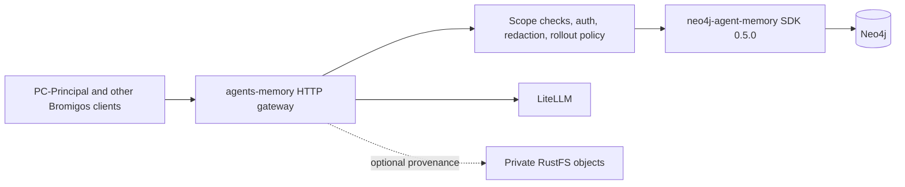
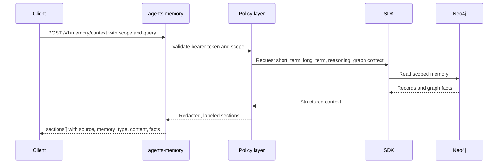

# agents-memory

`agents-memory` is the Bromigos policy gateway in front of Neo4j Agent Memory. It exposes a scoped HTTP API, enforces tenant and operator boundaries, applies redaction and rollout policy, and keeps other services away from direct Neo4j, Bolt, or SDK access.

This repo is not a thin SDK wrapper. It is the memory control plane for Bromigos workloads.

## What it does

- Accepts scoped message and event writes over HTTP.
- Builds prompt-safe memory context across `short_term`, `long_term`, `reasoning`, and graph-backed facts.
- Exposes operator-only search and write APIs for entities, facts, and preferences.
- Supports graph export, stats, dedup review and apply, consolidation dry runs and apply, and buffered write flush.
- Stores reasoning traces for audit and reuse, while keeping hidden chain-of-thought out of prompt recall and public memory.
- Applies redaction, feature flags, and safe defaults before the SDK or database sees a request.

## Architecture



## Gateway boundary

- `agents-memory` is the only Bromigos service in this workspace that talks to Neo4j and the Python SDK directly.
- Callers use HTTP only. They do not open Bolt connections, run Cypher, or import the SDK.
- Scope policy lives here, not in prompt templates or client-side filtering.
- The gateway redacts sensitive backend payloads before returning diagnostics, exports, consolidation reports, or reasoning results.

## Memory model

The primary prompt-facing route is `POST /v1/memory/context`.

- `short_term` covers recent turns and active session continuity.
- `long_term` covers durable facts, preferences, entities, and graph-backed recall.
- `reasoning` covers prior successful traces and tool-use summaries.

Reasoning memory is auditable, not free-form hidden thought. Trace endpoints store lifecycle data, steps, tool calls, and outcomes, but prompt recall must omit chain-of-thought style fields such as `thought` or `chain_of_thought`.

## Request and data flow



## API surface

### Health and diagnostics

- `GET /health` for shallow liveness.
- `GET /ready` for readiness after backend connection, schema bootstrap, and buffer readiness.
- `GET /v1/diagnostics` for authenticated non-secret configuration and backend readiness.

### Prompt and recall routes

- `POST /v1/context` keeps the legacy short-term contract.
- `POST /v1/memory/context` is the main combined memory endpoint.
- `POST /v1/graph/context` returns graph recall and scoped facts.
- `POST /v1/reasoning/context` returns prompt-safe reasoning recall.

### Message and event ingestion

- `POST /v1/messages` writes scoped user, assistant, or system messages.
- `POST /v1/events` writes one structured client event.
- `POST /v1/events/batch` writes up to 100 structured events per request.
- `POST /v1/memory/extraction/preview` previews extraction candidates before durable writes.

### Operator routes

- `GET /v1/memory/stats`
- `POST /v1/memory/graph/export`
- `POST /v1/memory/entities/search`
- `POST /v1/memory/facts/search`
- `POST /v1/memory/preferences/search`
- `POST /v1/memory/entities`
- `POST /v1/memory/facts`
- `POST /v1/memory/preferences`
- `GET /v1/memory/dedup/stats`
- `POST /v1/memory/dedup/candidates`
- `POST /v1/memory/dedup/apply`
- `POST /v1/memory/consolidation/dry-run`
- `POST /v1/memory/consolidation/apply`
- `POST /v1/memory/buffer/flush`

### Skill and reasoning routes

- `POST /v1/skills`
- `POST /v1/skills/proposals`
- `POST /v1/skills/usage`
- `POST /v1/reasoning/traces`
- `POST /v1/reasoning/traces/{trace_id}/steps`
- `POST /v1/reasoning/steps/{step_id}/tool-calls`
- `POST /v1/reasoning/traces/{trace_id}/complete`
- `POST /v1/reasoning/traces/list`
- `POST /v1/reasoning/traces/{trace_id}/detail`
- `POST /v1/reasoning/traces/similar`
- `POST /v1/reasoning/steps/search`
- `POST /v1/reasoning/tools/stats`

All routes except `/health` and `/ready` require `Authorization: Bearer <token>`.

## Auth and scope model

Every request is tenant-scoped through `MemoryScope`.

- `tenant_id`, `space_id`, `agent_id`, `session_id`, `user_id`, and `visibility` are required.
- Optional `guild_id` and `channel_id` support Discord-aware scoping.
- The gateway rejects scope mismatches before the backend runs.

Operator boundaries are split by token class.

- `AGENTS_MEMORY_TOKEN` for normal caller routes.
- `AGENTS_MEMORY_READ_OPERATOR_TOKEN` for diagnostics, stats, and search-style operator reads.
- `AGENTS_MEMORY_EXPORT_OPERATOR_TOKEN` for graph export.
- `AGENTS_MEMORY_WRITE_OPERATOR_TOKEN` for direct entity, fact, and preference writes.
- `AGENTS_MEMORY_ADMIN_OPERATOR_TOKEN` for dedup apply, consolidation apply, and buffer flush.

Production should not rely on predictable token defaults. Operator tokens are expected to come from secret-backed deployment config.

## Safe defaults and rollout posture

Several features exist, but they are controlled and not silently enabled.

- Extraction is off by default.
- Relation extraction is off by default and depends on entity extraction.
- OCR is off by default.
- RustFS source references are off by default.
- Prompt enrichment from entities, preferences, and reasoning is off by default.
- Consolidation scheduling is off by default.
- Buffered writes exist, but the default write mode is `sync`.

Preview comes before persistence. If extraction work is being evaluated, use `POST /v1/memory/extraction/preview` first.

## Extraction, OCR, and RustFS

- `POST /v1/messages` and `POST /v1/memory/extraction/preview` can carry raw text documents, OCR image references, and RustFS source references.
- OCR calls go through LiteLLM when enabled, with the homelab OCR alias configured as `unlimited-ocr`.
- RustFS is for private source artifacts and provenance, not public attachment dumping.
- Neo4j stores extracted text, provenance, checksums, source URIs, and metadata. It should not store raw media bytes.

## Dedup, consolidation, and buffering

- Dedup is review-first. Operators fetch candidate sets and apply a scoped `merge` or `reject` using dry-run tokens, snapshot hashes, and idempotency keys.
- Consolidation is also review-first. Dry runs are read-operator operations, apply requires admin operator auth and an explicit `apply=true` request.
- Buffered writes are available, but they are not the silent default. Operators can flush pending writes with `POST /v1/memory/buffer/flush`.

## Configuration

### Core settings

- `AGENTS_MEMORY_TOKEN`
- `AGENTS_MEMORY_READ_OPERATOR_TOKEN`
- `AGENTS_MEMORY_EXPORT_OPERATOR_TOKEN`
- `AGENTS_MEMORY_WRITE_OPERATOR_TOKEN`
- `AGENTS_MEMORY_ADMIN_OPERATOR_TOKEN`
- `AGENTS_MEMORY_TENANT_ID`
- `NEO4J_URI`
- `NEO4J_USERNAME`
- `NEO4J_PASSWORD`
- `LITELLM_BASE_URL`
- `LITELLM_API_KEY`
- `MEMORY_LLM`
- `MEMORY_EMBEDDING`
- `MEMORY_EMBEDDING_DIMENSIONS`

### Feature and policy settings

- `MEMORY_AUDIT_READ`
- `MEMORY_CONVERSATION_TTL_DAYS`
- `MEMORY_WRITE_MODE`
- `MEMORY_MAX_PENDING`
- `MEMORY_FACT_DEDUPLICATION_ENABLED`
- `MEMORY_TRACE_EMBEDDING_ENABLED`
- `MEMORY_EXTRACT_ENTITIES_ENABLED`
- `MEMORY_EXTRACT_RELATIONS_ENABLED`
- `MEMORY_EXTRACTION_PREVIEW_ENABLED`
- `MEMORY_EXTRACTION_BATCH_SIZE`
- `MEMORY_EXTRACTION_MAX_CONCURRENCY`
- `MEMORY_EXTRACTION_CHUNK_SIZE`
- `MEMORY_EXTRACTION_CHUNK_OVERLAP`
- `MEMORY_OCR_ENABLED`
- `MEMORY_OCR_MODEL`
- `MEMORY_OCR_MAX_IMAGE_BYTES`
- `MEMORY_RUSTFS_ENABLED`
- `MEMORY_RUSTFS_ENDPOINT`
- `MEMORY_RUSTFS_BUCKET`
- `MEMORY_RUSTFS_PREFIX`
- `MEMORY_RUSTFS_RETENTION_DAYS`
- `MEMORY_PROMPT_ENTITIES_ENABLED`
- `MEMORY_PROMPT_PREFERENCES_ENABLED`
- `MEMORY_PROMPT_REASONING_ENABLED`
- `MEMORY_CONSOLIDATION_SCHEDULE_ENABLED`

## Local development

```bash
uv sync
uv run uvicorn agents_memory.main:app --host 0.0.0.0 --port 8080 --reload
```

## Verification commands

```bash
uv run pytest tests/test_api.py -q
uv run pytest
uv run basedpyright
uv run ruff check .
```

## Deployment and GitOps

Homelab deployment assumes an internal service plus ingress, not a public load balancer.

- Kubernetes service type is `ClusterIP`.
- External access is exposed through Traefik `IngressRoute`.
- Operator tokens and backend credentials are wired through Helm and External Secrets Operator.
- ArgoCD is the expected reconciler for rollout and rollback.

### Rollout

1. Land the code or Helm change in Git.
2. Keep optional memory features disabled unless the rollout calls for them.
3. Let ArgoCD reconcile.
4. Verify `GET /ready`, authenticated `GET /v1/diagnostics`, and any changed dry-run or operator route.
5. For extraction work, verify `POST /v1/memory/extraction/preview` before enabling durable extraction paths.

### Rollback

1. Revert the smallest Git or Helm change that introduced the behavior.
2. Let ArgoCD reconcile.
3. Preserve compatibility by keeping legacy `/v1/context` available while callers back away from optional combined sections.

## Current guarantees and non-goals

### Current guarantees

- HTTP is the supported client boundary.
- Scope and tenant checks happen before backend access.
- Reasoning traces are available for audit and retrieval without exposing raw hidden thought.
- Export, dedup, and consolidation responses are redacted before leaving the gateway.

### Non-goals in this repo

- Direct client access to Neo4j or Bolt.
- SDK passthrough without gateway policy.
- Public storage of raw media bytes inside Neo4j.
- Silent enablement of extraction, OCR, prompt enrichment, consolidation scheduling, or buffered writes.

## Upstream attribution

This service is built on top of `neo4j-agent-memory==0.5.0`, but the Bromigos-specific value here is the gateway layer: HTTP contracts, auth model, scope enforcement, rollout controls, and redaction policy.
