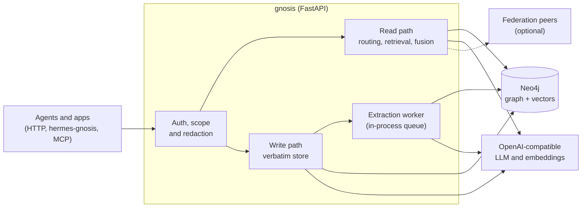

# gnosis

Long-term memory for AI agents, behind a scoped and redacted HTTP API.

**Status:** active. A maintained fork of [nolgiainc/gnosis](https://github.com/nolgiainc/gnosis).

[](https://github.com/bromigos-org/gnosis/actions/workflows/ci.yml)
[](https://github.com/bromigos-org/gnosis/actions/workflows/gitleaks.yml)


gnosis is a self-hosted memory service for AI agents. Agents send it what they
learn and ask it for context later. It stores memories in a Neo4j graph and
vector store. It reaches models through any OpenAI-compatible endpoint, such as
LiteLLM, OpenAI or a local ollama.

Clients talk to gnosis over HTTP, or over MCP if you turn it on. They never
connect to Neo4j themselves. Every request carries a scope, which says whose
memory it is. gnosis checks that scope on every read and write. It redacts what
it returns, and it renders results as prompt-ready sections.


```mermaid
flowchart LR
    clients["Agents and apps<br/>(HTTP, hermes-gnosis, MCP)"]
    subgraph gnosis["gnosis (FastAPI)"]
        policy["Auth, scope<br/>and redaction"]
        read["Read path<br/>routing, retrieval, fusion"]
        write["Write path<br/>verbatim store"]
        worker["Extraction worker<br/>(in-process queue)"]
    end
    neo4j[("Neo4j<br/>graph + vectors")]
    llm["OpenAI-compatible<br/>LLM and embeddings"]
    peers["Federation peers<br/>(optional)"]

    clients --> policy
    policy --> read
    policy --> write
    write --> worker
    read --> neo4j
    write --> neo4j
    worker --> neo4j
    read --> llm
    write --> llm
    worker --> llm
    read -.-> peers
```

## Why it exists

An agent forgets everything between sessions. A plain vector store remembers,
but it has no access model and returns raw rows. gnosis adds the layer in
between:

- bearer-token auth with separate least-privilege token classes
- tenant, space and user isolation on every read and write
- redaction of everything that could reach a prompt
- measured retrieval features, each behind its own flag

## About this fork

This repository is a fork of [nolgiainc/gnosis](https://github.com/nolgiainc/gnosis).
It is active, not a stale mirror. Its `main` branch is the source for the
Bromigos org's own gnosis image, and research done here is synced back
upstream.

As of 2026-10-05 the fork has every upstream change through `4417d57`. It also
carries these changes of its own:

- Point-in-time reads (`as_of`), LLM-free requests and append-only adds
  (`ade7be0`).
- Fields named like identifiers keep their values under redaction (`f24d1fe`).
- One Neo4j driver and one LiteLLM client per process (`7d53281`).
- Graph-QA accepts `neo4j.Record` rows, and its per-row tenant filter checks
  record keys rather than values.
- `space_id` scopes every memory read, update, delete and supersession, not
  only tenant and user. See [Scope enforcement](docs/security.md#scope-enforcement).

The fork's CI publishes its own image, `ghcr.io/bromigos-org/gnosis`.
Upstream's Artifact Registry job is removed here.

## Quick start

You need Docker with Compose v2 and an OpenAI-compatible chat and embedding
endpoint. The tracked [`compose.yaml`](compose.yaml) starts Neo4j and gnosis. By
default it points gnosis at ollama on your host.

`compose.yaml` names the image `ghcr.io/nolgiainc/gnosis:latest`. That image is
private, so build it from this checkout under the same tag first. Compose then
uses your local build instead of pulling.

```bash
git clone https://github.com/bromigos-org/gnosis.git
cd gnosis
docker build -t ghcr.io/nolgiainc/gnosis:latest .
ollama pull llama3.2:latest
ollama pull nomic-embed-text
docker compose up -d
```

To use LiteLLM, OpenAI or another endpoint instead of ollama, set
`OPENAI_BASE_URL`, `OPENAI_API_KEY`, `GNOSIS_LLM` and `GNOSIS_EMBEDDING` in
your shell or in a `.env` file next to `compose.yaml`.

Check that it is up. `/health` answers as soon as the process runs. `/ready`
answers `503` until Neo4j and the schema are ready.

```bash
curl -fsS http://localhost:8080/health
curl -fsS http://localhost:8080/ready
```

The compose file uses placeholder dev tokens such as `dev-token`. Replace them
with real secrets before you keep any data in it. To tear everything down,
including the Neo4j volume, run `docker compose down -v`.

### Write and read a memory

This writes one memory verbatim. A verbatim write makes no LLM call.

```bash
export GNOSIS_URL=http://localhost:8080
export GNOSIS_TOKEN=dev-token

curl -fsS "$GNOSIS_URL/v1/memories" \
  -H "Authorization: Bearer $GNOSIS_TOKEN" \
  -H 'Content-Type: application/json' \
  -d '{
    "scope": {"tenant_id":"nolgia","space_id":"demo","agent_id":"assistant",
              "session_id":"session-1","user_id":"alice","visibility":"private_user"},
    "content": "Alice moved from Seattle to Austin in March.",
    "infer": false
  }'
```

This asks for context in a later session. Keep the same tenant, space and user.

```bash
curl -fsS "$GNOSIS_URL/v1/memory/context" \
  -H "Authorization: Bearer $GNOSIS_TOKEN" \
  -H 'Content-Type: application/json' \
  -d '{
    "scope": {"tenant_id":"nolgia","space_id":"demo","agent_id":"assistant",
              "session_id":"session-2","user_id":"alice","visibility":"private_user"},
    "query": "Where does Alice live?",
    "max_items": 8
  }'
```

The response holds `sections[]`, the scoped and redacted context. The
`tenant_id` must match the server's `GNOSIS_TENANT_ID`, which defaults to
`nolgia`. Any other tenant gets a `403`.

To have gnosis extract facts from a conversation, send a `messages` array with
`"infer": true`. Extraction calls the model in `GNOSIS_LLM`, so set it to a
capable chat model.

The [getting started guide](docs/getting-started.md) goes further. It wires a
hermes agent to gnosis through the hermes-gnosis plugin.

## Run from source

gnosis targets Python 3.13 and uses [uv](https://docs.astral.sh/uv/). Export
the required settings first (see [Configure](#configure)), then start the
server:

```bash
uv sync --locked
uv run uvicorn gnosis.main:app --host localhost --port 8080
```

## Configure

Every setting is an environment variable or a key in a YAML config file. These
must be set, or gnosis will not start:

- `GNOSIS_TOKEN`, the service token for normal callers
- `GNOSIS_READ_OPERATOR_TOKEN`, `GNOSIS_WRITE_OPERATOR_TOKEN`,
  `GNOSIS_EXPORT_OPERATOR_TOKEN` and `GNOSIS_ADMIN_OPERATOR_TOKEN`
- `NEO4J_URI` and `NEO4J_PASSWORD`
- `LITELLM_BASE_URL` and `LITELLM_API_KEY`, for the OpenAI-compatible endpoint

When `GNOSIS_CONFIG_FILE` is unset, gnosis loads
[`configs/default.yaml`](configs/default.yaml). That file turns on the
best-measured features: fact extraction, the entity graph, adaptive routing and
Chain-of-Note. Set `GNOSIS_CONFIG_FILE=""` to start from the minimal defaults
instead, with every optional feature off. Or point it at one of the
[run configs](configs/README.md).

Settings resolve in this order, highest first:

1. environment variables
2. a `.env` file in the working directory
3. the YAML config file
4. code defaults

The [configuration reference](docs/configuration.md) lists every setting.

## Features

Every feature below is a flag. Each one is off by default, and the code path is
unchanged while it is off.

### Write path

- **Verbatim storage.** Stores content as a dated, scoped memory with no LLM
  call.
- **Fact extraction** (`GNOSIS_FACT_EXTRACTION_ENABLED`). Turns conversation
  turns into short, dated, self-contained facts at ingest. This is the largest
  single gain measured, worth +11.7 J on LOCOMO.
- **Entity graph** (`GNOSIS_ENTITY_GRAPH_ENABLED`). Builds a Neo4j graph of the
  entities that facts name and how they relate. Graph-based multi-hop
  retrieval reads it.
- **Community graph** (`GNOSIS_COMMUNITY_GRAPH_ENABLED`). Clusters related
  entities and stores an LLM summary of each cluster. It was tested and
  rejected on LongMemEval_S (run L-27).
- **Buffered writes** (`GNOSIS_WRITE_MODE=buffered`). Acknowledges writes
  early and flushes a bounded queue.

### Read path

- **BM25 and dense fusion** (`GNOSIS_HYBRID_RETRIEVAL_ENABLED`). Fuses
  full-text and vector search with reciprocal rank fusion.
- **Adaptive routing** (`GNOSIS_ADAPTIVE_ROUTING_ENABLED`). One cheap LLM call
  classifies each query. gnosis then applies the feature set that measured best
  for that kind of query. This beat every single global setting by 2.9 J.
- **Scoped dense retrieval** (`GNOSIS_SCOPED_DENSE_RETRIEVAL_ENABLED`). Narrows
  vector search to the caller's scope inside the query. Turn it on when one
  store holds many users.
- **Graph-QA fusion** (`GNOSIS_GRAPHQA_FUSION_ENABLED`). Plans a read-only
  Cypher query over the entity graph and fuses its results with vector hits. It
  also needs `GNOSIS_GRAPHQA_ENABLED=true`. Read the
  [graph-QA safety notes](docs/security.md#graph-qa-safety) first.
- **LLM reranker** (`GNOSIS_RERANK_ENABLED`). Reorders the top candidates before
  the budget cut. On LongMemEval_S it helped single-session-user questions but
  hurt temporal ones, so it stays off.
- **Chain-of-Note** (`GNOSIS_CHAIN_OF_NOTE_ENABLED`). Adds a reading
  instruction that makes the answering model cite evidence and abstain when the
  context falls short. It is skipped on temporal queries, where it hurts.
- **Sufficiency check** (`GNOSIS_SUFFICIENCY_CHECK_ENABLED`). Judges whether
  the context answers the query and reports that to the client. It never blocks
  a response.
- **Multi-query rewrite** (`GNOSIS_QUERY_REWRITE_ENABLED`). When the
  sufficiency check fails, it writes two or three extra queries and fuses their
  results. It needs the sufficiency check on.
- **Read-time supersession** (`GNOSIS_READ_SUPERSESSION_ENABLED`). When two
  facts fill the same slot, the newest one wins.

### Trust and safety

- Every operation carries a scope of `tenant_id`, `space_id`, `agent_id`,
  `session_id`, `user_id` and `visibility`. A tenant mismatch is rejected
  before the backend runs.
- Read, write, export, admin and federation access use separate tokens.
- Everything that can reach a prompt is redacted.
- Callers never send Cypher. Graph-QA plans its own and validates it.
- Dedup and consolidation run as dry runs unless you apply them.
- Federation shares a memory only when its metadata says
  `"shareable": true`.

## API surface

| Surface | Routes |
|---|---|
| Health | `GET /health`, `GET /ready`, `GET /v1/diagnostics` |
| Memory | `POST /v1/memories`, `/v1/memories/search`, `/v1/memories/list`, `/v1/memories/promote` |
| Context | `POST /v1/memory/context`, `/v1/graph/context`, `/v1/reasoning/context` |
| Ingestion | `POST /v1/messages`, `/v1/events`, `/v1/events/batch`, `/v1/memory/extraction/preview` |
| Editing | `PATCH` and `DELETE /v1/memories/{memory_id}`, when `GNOSIS_MEMORY_EDIT_ENABLED=true` |
| MCP | Streamable HTTP at `/mcp`, when `GNOSIS_MCP_ENABLED=true` |

`/health` and `/ready` need no token. Every other route needs
`Authorization: Bearer <token>`. Operator routes need an operator token. The
full schema is at `/docs` and `/openapi.json` on a running server. The
[provider surface](docs/provider-surface.md) explains the contract.

## Test

CI runs four gates. Run all four before you push. They are separate checks, so
passing `ruff check` does not mean `ruff format --check` passes.

```bash
uv sync --locked
uv run ruff check
uv run ruff format --check
uv run basedpyright
uv run pytest -q
```

The test suite needs no running Neo4j or model. The
[development guide](docs/development.md) covers single-file test runs, the
feature-flag pattern and how to measure a change.

## Deploy

- The [`Dockerfile`](Dockerfile) installs from the pinned `uv.lock`, copies
  `src/` and `configs/`, and starts Uvicorn on port 8080.
- [`compose.yaml`](compose.yaml) is a minimal stack for local use. It is not a
  production topology and does not manage secrets.
- [`ci.yml`](.github/workflows/ci.yml) runs the four gates on every pull request
  and every push to `main`. A push to `main` also builds
  `ghcr.io/bromigos-org/gnosis:sha-<commit>`, scans it with Trivy, then moves
  `:latest` to it. The job summary records the image digest.
- [`gitleaks.yml`](.github/workflows/gitleaks.yml) scans for secrets on every
  pull request and every push to `main`.

Your deployment environment owns ingress, secrets and rollout. Keep every token
in secret-backed configuration, never in git. Pin images by digest rather than
`:latest`. The [operations guide](docs/operations.md) covers probes, the
extraction worker and backup.

## Benchmarks

gnosis is measured with [gnosis-membench](https://github.com/nolgiainc/gnosis-membench).
Its [RESULTS.md](https://github.com/nolgiainc/gnosis-membench/blob/main/RESULTS.md)
is the canonical record. [docs/BENCHMARKS.md](docs/BENCHMARKS.md) mirrors it.

**LongMemEval_S, all 500 questions.** The best overall score so far is 75.2%.
Run L-35 set it on 2026-08-10, and L-37 and L-38 tied it. These runs use gpt-4o
as both the answering model and the judge. For comparison, Zep scores 71.2% and
mem0 67.6% with a gpt-4o backbone. Most of the gains from L-32 to L-37 came
from the harness's answering prompt, not from gnosis itself.

**LOCOMO, all 10 conversations (Run 23).** These scores use `configs/default.yaml`
and a gpt-5.5 judge.

| Category | gnosis | mem0 | mem0-graph | Zep |
|---|---|---|---|---|
| single-hop J | **77.0** | 67.13 | 65.71 | 61.70 |
| temporal J | **73.8** | 55.51 | 58.13 | 49.31 |
| multi-hop F1 | **34.3** | 28.64 | 24.32 | 19.37 |
| open-domain J | 29.2 | 72.93 | 75.71 | **76.60** |
| adversarial J | **83.9** | — | — | — |
| J excluding adversarial | **66.9–68.9** | 66.88 | 68.44 | 65.99 |

Open-domain questions are the main LOCOMO gap.

## Documentation

Start with [docs/README.md](docs/README.md), the documentation index.

- [Getting started](docs/getting-started.md): run gnosis and connect an agent
- [Configuration](docs/configuration.md): every setting and its default
- [Provider surface](docs/provider-surface.md): the HTTP and MCP contract
- [Security](docs/security.md): tokens, scope, redaction and federation
- [Operations](docs/operations.md): probes, workers, backup and scale
- [Architecture](docs/architecture.md): request flow and module map
- [Data model](docs/data-model.md): the graph schema and the scope fields
- [Capabilities](docs/CAPABILITIES.md): each technique and its research basis
- [Development](docs/development.md): contributing and measuring changes
- [Benchmarks](docs/BENCHMARKS.md): the run ledger

## Related projects

- [gnosis-membench](https://github.com/nolgiainc/gnosis-membench) is the
  benchmark harness for LOCOMO and LongMemEval.
- [hermes-gnosis](https://github.com/nolgiainc/hermes-gnosis) is a memory
  provider plugin that connects NousResearch hermes agents to gnosis.
